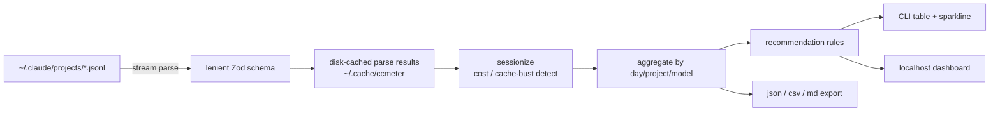

# ccmeter

[](https://github.com/vnmoorthy/ccmeter/actions/workflows/ci.yml)
[](https://www.npmjs.com/package/ccmeter)
[](LICENSE)
[](#install)

> **Local-first spend & cache-efficiency dashboard for Claude Code.**
> Reads `~/.claude/projects`, tells you exactly what's costing you. No telemetry, no API key, no setup.

```bash
npx ccmeter
```

That's it. ccmeter parses the JSONL session files Claude Code already writes to disk and gives you a five-second answer to "why did my bill jump?".

<p align="center">
  
</p>

<p align="center"><sub><em>Real numbers from a heavy user's <code>~/.claude/projects</code>, with project names anonymized via <code>--anonymize</code>. Run <code>ccmeter</code> on your own logs to see your version of this.</em></sub></p>

---

## Why this exists

In **early March 2026**, Anthropic shortened Claude Code's default prompt-cache TTL from 1 hour to 5 minutes — quietly, with a staggered rollout that landed on different users on different days. Anthropic's [official position](https://www.theregister.com/2026/04/13/claude_code_cache_confusion/) is that this should not increase costs because most cached context is one-shot anyway. [User analysis](https://github.com/anthropics/claude-code/issues/46829) of session JSONLs disagrees: typical impact is a **30–60%** bill increase with no change in usage.

The Anthropic Console gives you one number per day. What you need is a per-session, per-project, per-cache-bust breakdown so you can:

- Verify which side of that argument your data falls on.
- Find which sessions are the new expensive ones.
- Apply the specific behavioral fix that recovers most of the $.

ccmeter is that breakdown. It runs against the data already on your machine, surfaces the patterns that are eating your spend, and recommends concrete fixes ranked by estimated monthly savings.

## Install

```bash
# fastest — no install
npx ccmeter@latest

# permanent
npm i -g ccmeter
ccmeter
```

Requires Node 20+. Works on macOS, Linux, Windows. Reads `~/.claude/projects` by default — set `CCMETER_LOG_DIR` if your logs live elsewhere.

## What you can do in 60 seconds

```bash
ccmeter                             # summary: spend, cache hits, today's biggest leak
ccmeter recommend                   # personalized fixes ranked by $/mo saved
ccmeter compare                     # last 7d vs prior 7d — quantify what changed
ccmeter tools                       # which tool calls cost the most (Bash, Read, …)
ccmeter cache                       # cache hit rate trend + April-2 TTL-change callout
ccmeter whatif --swap opus->sonnet  # simulate model swaps on YOUR data
ccmeter dashboard                   # local web UI, no network
ccmeter share                       # copy-pasteable Markdown card for Reddit / Twitter
ccmeter tag $SID "auth-refactor"    # tag a session, then group by tag in any report
ccmeter live                        # full-screen ticker — record a gif of this
```

Don't have Claude Code installed yet but want to see what ccmeter looks like? Try the synthetic-data demo: `ccmeter --demo`.

## Commands

| command | what it does |
| --- | --- |
| `ccmeter` | one-screen summary (default — same as `ccmeter summary`) |
| `ccmeter sessions` | sortable table of sessions: cost, duration, busts, tag |
| `ccmeter cache` | cache hit rate, bust count, $ wasted on busts, April-2 callout |
| `ccmeter recommend` | personalized cost-cutting rules sorted by monthly savings |
| `ccmeter tools` | per-tool cost breakdown — answers "which subagent ate the budget" |
| `ccmeter compare` | week-over-week (or any two-period) deltas across all metrics |
| `ccmeter whatif` | simulate model swaps & cache TTL scenarios on YOUR data |
| `ccmeter share` | shareable Markdown stat-card or social SVG (paths redacted) |
| `ccmeter live` | full-screen ticker — each turn lands as it happens |
| `ccmeter dashboard` | local web UI on `127.0.0.1:7777` (no network egress) |
| `ccmeter export` | dump full analysis as `json`/`csv`/`md` (paths redacted by default) |
| `ccmeter --anonymize ...` | replace project paths/ids with stable anonymous labels — safe for screenshots & demos |
| `ccmeter watch` | one-line live tail today's spend (perfect for tmux/PS1) |
| `ccmeter prompt --budget 10` | one-line, color-coded $ for your shell prompt |
| `ccmeter metrics` | Prometheus exposition — scrape into Grafana |
| `ccmeter tag <id> <label>` | annotate a session for grouped reporting |
| `ccmeter budget --set 200` | set & track a monthly budget |
| `ccmeter digest --webhook URL` | post a weekly digest to Slack/Discord |
| `ccmeter merge a.json b.json` | combine analyses from multiple machines |
| `ccmeter doctor` | diagnose your setup |
| `ccmeter check-privacy` | exhaustive list of every file ccmeter would read |
| `ccmeter clear-cache` | drop the parsed cache at `~/.cache/ccmeter` |

Run any command with `--help` for full options.

## What you'll see

```
ccmeter — last 30 days
────────────────────────────────────────────────────────────────────────────────
Total spend       $284.10   (↑ +43% vs prior period)
Daily average     $9.47     ≈ $284.10/month
Sessions          127
Cache hit rate    47.3%
Cache busts       89        wasted $24.18

Daily spend  ▁▂▂▃▅▇█▆▄▅█▇▆▄▃

Suggestions:
  ● Idle sessions are busting your cache 41× per week (save $43/mo)
  ● 6 long sessions (>90 min) bled cache value (save $18/mo)
  + 4 more — run `ccmeter recommend`
```

## Privacy

Default ccmeter behavior:

- **Reads** only files under `~/.claude/projects` (the Claude Code session log directory).
- **Writes** a gzipped parsed-result cache to `~/.cache/ccmeter`.
- **Sends nothing.** No analytics, no telemetry, no ping-home, no `npm-bundle-tracker`.

The two commands that touch the network — `ccmeter digest` (POSTs to your webhook) and `CCMETER_CHECK_UPDATES=1` (queries npm registry) — are both **off by default and opt-in only**. Run `ccmeter check-privacy` for an exhaustive enumeration of every file ccmeter touches.

```bash
ccmeter check-privacy
```

The parser source is one file: [`src/core/jsonl/reader.ts`](src/core/jsonl/reader.ts). Audit-friendly under 5,000 lines total.

## How it works



The recommendation rules each live in their own ~30-line file under [`src/core/analysis/recommend/rules/`](src/core/analysis/recommend/rules/). To add one, copy [`_template.ts`](src/core/analysis/recommend/rules/_template.ts), implement the `Rule` function, and register it in `index.ts`. PRs are warmly invited.

## Pricing accuracy

ccmeter ships a built-in pricing table verified against Anthropic's public pricing on **2026-04-25**. Anthropic adjusts prices regularly. To override, drop a JSON file at `~/.config/ccmeter/pricing.json`:

```json
{
  "claude-sonnet-4-6": {
    "input": 3.0, "output": 15.0,
    "cache_5m_write": 3.75, "cache_1h_write": 6.0, "cache_read": 0.3
  }
}
```

Values you set override the built-in. Other models continue to use built-in defaults.

## FAQ

**Is this safe to run?** Yes. Read [`src/core/jsonl/reader.ts`](src/core/jsonl/reader.ts) — it opens files for read, JSON.parses each line, and never executes any of the contents. There is no network call in the default path.

**Does this work with the Claude Code Pro subscription, or only API users?** Both. The JSONL format is the same; ccmeter calculates "what this would cost on the API" for both audiences. Subscription users get a useful "if I were paying API rates I'd owe $X" number plus the cache/efficiency analysis.

**My bill on the Console doesn't match ccmeter — why?** Three common reasons: (1) Console aggregates across all your API usage, ccmeter only sees Claude Code; (2) Console has billing-cycle latency; ccmeter is real-time; (3) pricing tables drift — see "Pricing accuracy" above. If you see a >5% discrepancy after accounting for those, run `ccmeter selftest` and [open an issue](https://github.com/vnmoorthy/ccmeter/issues) with the redacted output — fixing it benefits everyone.

**Are the dollar numbers exact?** They're as exact as the public pricing table allows. Run `ccmeter pricing` to see every model's input / output / cache rate ccmeter is using. If you have a private rate (enterprise contract, batch API, AWS Bedrock), drop a JSON file at `~/.config/ccmeter/pricing.json` and ccmeter will use your numbers instead.

**What's the deal with the cache TTL?** Anthropic shortened Claude Code's default prompt-cache TTL from 1 hour to 5 minutes in early March 2026 (rollout staggered across users; tracked in [anthropics/claude-code#46829](https://github.com/anthropics/claude-code/issues/46829)). Anthropic says this should not increase costs. User analysis says it does, by 30–60% for typical heavy use. ccmeter computes the bust cost from your own data so you can settle that argument with numbers, not opinions.

**Where do my logs live?** Default `~/.claude/projects/`. Override with `CCMETER_LOG_DIR=/path/to/logs` or `--log-dir`.

**Can I use ccmeter in CI?** Yes — `ccmeter export --format json` produces a stable schema you can pipe into anything. `ccmeter merge` combines per-machine exports for team-level reports. There's a ready-made GitHub Actions workflow template at [`docs/github-action-template.yml`](docs/github-action-template.yml) that posts Claude Code spend as a sticky PR comment.

**Does the dashboard send any data anywhere?** No. The HTTP server binds to `127.0.0.1` only and refuses non-localhost requests. The bundled SPA only fetches `/api/*` from that same local server. There's a per-launch bearer token in the URL so other apps on your machine can't snoop.

## Roadmap

Already shipped in `0.2`:
- [x] Per-tool-call cost breakdown (`ccmeter tools`)
- [x] Session tagging via `ccmeter tag <session-id> <name>`
- [x] Prometheus exposition for both CLI and dashboard
- [x] Two-period comparator (`ccmeter compare`)
- [x] Shareable Markdown / SVG stat cards (`ccmeter share`)
- [x] Full-screen live ticker (`ccmeter live`)

Up next, ranked by "would the average heavy user actually want this":
- [ ] Per-prompt quality scoring ("which prompts gave you the most output per dollar")
- [ ] Desktop notification (macOS / Linux) when projected monthly spend exceeds budget
- [ ] iCal export of session timelines (for billable-time tracking)
- [ ] Native macOS menu-bar app
- [ ] VS Code / JetBrains extension that surfaces today's spend in the status bar
- [ ] Integration with Anthropic's `/v1/usage` API for billing-period reconciliation
- [ ] "Best practice" comparator — anonymized aggregate of community usage (opt-in)
- [ ] Python and Go ports of the core analyzer (so users can pipe it into existing tooling)
- [ ] Per-team aggregation server (opt-in, self-hosted) for engineering managers
- [ ] Auto-tagging by inferred PR/feature using git branch context at session start
- [ ] Cohort / retention analytics for org-level rollouts
- [ ] SaaS-free, fully local "AI Coach" that watches your sessions and warns about $-anti-patterns in real time

## Contributing

```bash
git clone https://github.com/vnmoorthy/ccmeter
cd ccmeter
npm install
npm run dev          # rebuilds CLI on save
npm run dev:web      # vite dev server for the dashboard
npm test
```

Recommendation rules, pricing-table updates, and parser improvements are all great PRs. The whole codebase is intentionally under 5,000 lines so a contributor can read it in a sitting.

## License

MIT — see [LICENSE](LICENSE).

---

If ccmeter saves you money, please [star the repo](https://github.com/vnmoorthy/ccmeter) — it helps other people find it. If you have a cost pattern that ccmeter didn't catch, [open an issue](https://github.com/vnmoorthy/ccmeter/issues) with a redacted export and we'll add a rule.

Found a bug, hate the colors, or want a recommendation rule of your own? PRs of any size are welcome. The codebase is intentionally small and every part is documented — the goal is for the median Claude Code user to be able to read [`src/core/jsonl/reader.ts`](src/core/jsonl/reader.ts), trust what they see, and start hacking.
